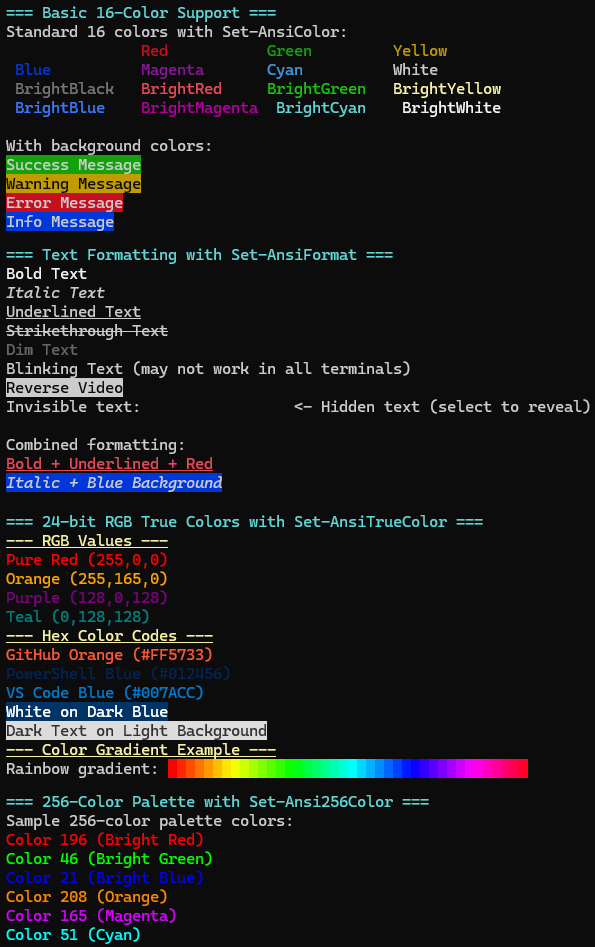

# PSAnsiEscape

A PowerShell module that makes using ANSI escape sequences in the terminal easy. This module provides simple functions for colors, text formatting, cursor movement, and screen manipulation using ANSI escape codes.

## Features

- **Color Support**: Apply foreground and background colors to text
- **Text Formatting**: Bold, italic, underline, strikethrough, and more
- **Cursor Movement**: Move cursor position, save/restore positions
- **Screen Manipulation**: Clear screen, lines, and scroll functionality
- **Custom Sequences**: Create custom ANSI escape sequences



## Installation

1. Copy the module folder to one of your PowerShell module paths:
   ```powershell
   $env:PSModulePath -split ';'
   ```

2. Import the module:
   ```powershell
   Import-Module PSAnsiEscape
   ```

## Functions

### Set-AnsiColor
Apply ANSI color formatting to text.

```powershell
# Basic color
Set-AnsiColor -Text "Hello World" -ForegroundColor Red

# Color with background
Set-AnsiColor -Text "Important Message" -ForegroundColor White -BackgroundColor Red

# Pipeline support
"Hello World" | Set-AnsiColor -ForegroundColor Green
```

**Available Colors:**
- Black, Red, Green, Yellow, Blue, Magenta, Cyan, White
- BrightBlack, BrightRed, BrightGreen, BrightYellow, BrightBlue, BrightMagenta, BrightCyan, BrightWhite

### Set-AnsiFormat
Apply ANSI text formatting.

```powershell
# Bold text
Set-AnsiFormat -Text "Bold Text" -Bold

# Multiple formats
Set-AnsiFormat -Text "Important" -Bold -Underline

# Pipeline support
"Italic Text" | Set-AnsiFormat -Italic
```

**Available Formats:**
- Bold, Italic, Underline, Strikethrough, Dim, Reverse

### Move-AnsiCursor
Move the cursor position.

```powershell
# Move relative
Move-AnsiCursor -Up 3
Move-AnsiCursor -Left 5

# Move to specific position
Move-AnsiCursor -Row 10 -Column 5

# Home position
Move-AnsiCursor -Home

# Save and restore position
Move-AnsiCursor -SavePosition
# ... do some work ...
Move-AnsiCursor -RestorePosition
```

### Clear-AnsiScreen
Clear screen content.

```powershell
# Clear entire screen
Clear-AnsiScreen -All

# Clear current line
Clear-AnsiScreen -CurrentLine

# Clear from cursor to end of line
Clear-AnsiScreen -FromCursorToEndOfLine

# Scroll screen
Clear-AnsiScreen -ScrollUp 5
```

### New-AnsiSequence
Create custom ANSI escape sequences.

```powershell
# Get raw sequence
$redColor = New-AnsiSequence -Code "31m" -Raw

# Execute sequence directly
New-AnsiSequence -Code "2J"  # Clear screen
```

## Examples

### Basic Usage
```powershell
# Import the module
Import-Module PSAnsiEscape

# Colorize some text
Write-Host (Set-AnsiColor -Text "Success!" -ForegroundColor Green)
Write-Host (Set-AnsiColor -Text "Warning!" -ForegroundColor Yellow)
Write-Host (Set-AnsiColor -Text "Error!" -ForegroundColor Red)

# Format text
Write-Host (Set-AnsiFormat -Text "Important Notice" -Bold -Underline)
```

### Advanced Example
```powershell
# Save cursor position
Move-AnsiCursor -SavePosition

# Clear screen and go to top
Clear-AnsiScreen -All
Move-AnsiCursor -Home

# Create a colored header
$header = Set-AnsiColor -Text "  SYSTEM STATUS  " -ForegroundColor White -BackgroundColor Blue
$header = Set-AnsiFormat -Text $header -Bold

Write-Host $header

# Move cursor and display status items
Move-AnsiCursor -Row 3 -Column 1
Write-Host "Status: " -NoNewline
Write-Host (Set-AnsiColor -Text "OK" -ForegroundColor Green)

Move-AnsiCursor -Row 4 -Column 1
Write-Host "Memory: " -NoNewline
Write-Host (Set-AnsiColor -Text "85%" -ForegroundColor Yellow)

# Restore cursor position
Move-AnsiCursor -RestorePosition
```

### Pipeline Usage
```powershell
"Hello", "World" | ForEach-Object {
    $_ | Set-AnsiColor -ForegroundColor (Get-Random -InputObject @('Red', 'Green', 'Blue', 'Yellow'))
} | ForEach-Object {
    Write-Host $_
}
```

## Requirements

- PowerShell 5.1 or higher
- Terminal that supports ANSI escape sequences (Windows Terminal, PowerShell 7, most Unix terminals)

## Compatibility

This module works with:
- PowerShell 5.1 (Windows PowerShell)
- PowerShell 7+ (PowerShell Core)
- Windows Terminal
- Most modern terminal emulators

**Note:** Some older terminals or the legacy Windows console may have limited ANSI support.

## License

This project is licensed under the MIT License.

## Contributing

Contributions are welcome! Please feel free to submit pull requests or open issues for bugs and feature requests.